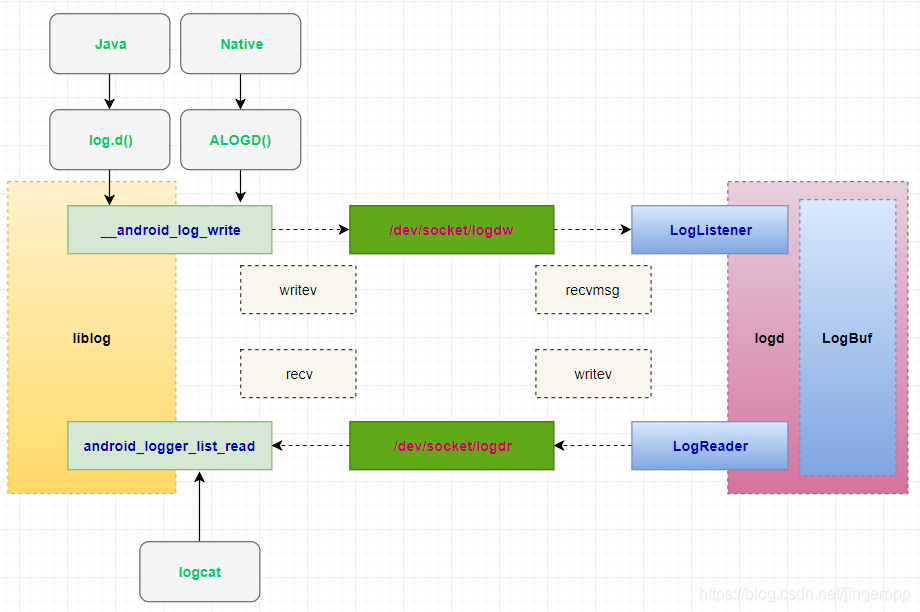
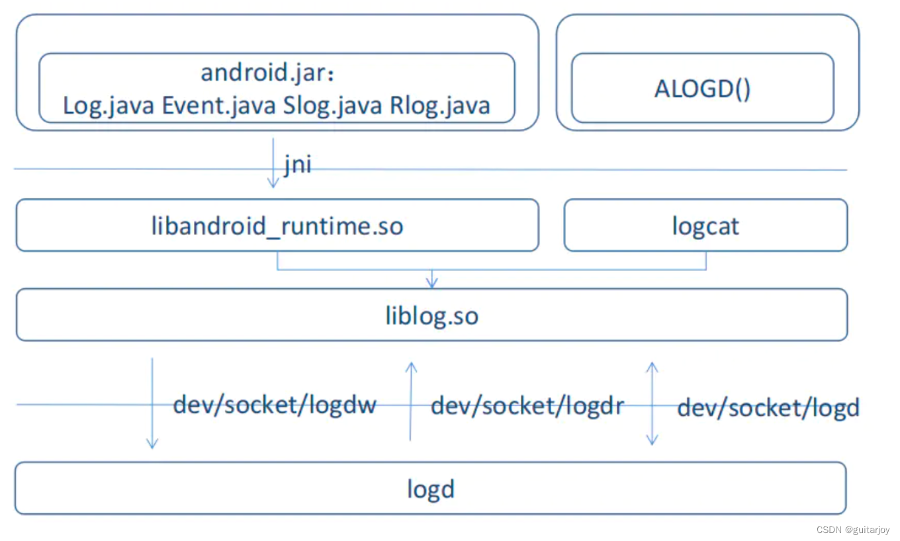

<!--more-->

## 写在前面

参考：
https://www.cnblogs.com/andy-songwei/p/9676823.html
https://blog.csdn.net/shift_wwx/article/details/89138117

https://blog.csdn.net/u010128475/article/details/125074826
https://blog.csdn.net/u010128475/article/details/125155785

https://blog.51cto.com/u_15243273/5426776

https://blog.csdn.net/temp7695/article/details/126227952
https://juejin.cn/post/7137179033480986655


## 规范：

1. 不允许使用VEROSE级别的log
2. INFO、WARN只允许打印少量重要信息；
3. 只有出现极严重的错误的时候才可使用ERROR（比如导致系统的崩溃）
4. 尽量使用DEBUG级别。
5. 用户的隐私信息进制打印。
6. 禁止再循环中打印log。
7. 尽量不打印堆栈
8. 尽量不要在生产环境打印debg级别
9. 打印exception信息一般使用Warn级别，而Error级别用于打印更为危险的信息，比如系统的崩溃等。
10. 使用门面模式对应用模块与日志工具解耦。


adb shell setprop log.tag.tagName level 不仅会改变Log.isLoggable(tag,level)的返回值，也会影响到Log.v() - Log.e() 是否打印

## 正文




可以使用`Log.isLoggable(tagName,level)`来判断是否允许打印log，然后可以在user版本中，通过下面的指令来控制日志的输出：

```
adb shell setprop log.tag.tagName level
```

当我从`Log.d()`开始追踪，会进入`android.util.Log`的`print()`函数：

```java
/** @hide */ @SuppressWarnings("unused")
public static int println(int bufID,
        int priority, String tag, String msg) {
    return 0;
}
```

>用@hide 注解标记的类或函数是google有意隐藏的，不能通过sdk查看

擦，标记为`@hide`，不能查看，那就直接去android.jar中找println方法的实现：

1. 在AndroidSDK/platforms/android-30中解压缩android.jar;
2. 在解压后的目录中找到android/util/Log.class直接拖进AS中反编译;
3. 看到println方法为：

```java
public static int println(int priority, @Nullable String tag, @NonNull String msg) {
    throw new RuntimeException("Stub!");
}
```

>`throw new RuntimeException("Stub!");`表示实际运行时的这句逻辑会被ROM中相同的类代替执行。

具体实现在AOSP的`frameworks/base/core/java/android/util/Log.java`:

```java
/**
 * 长消息的帮助程序功能。使用 LineBreakBufferedWriter 沿换行符分解长消息和堆栈跟踪，但尝试以大块写入。这是为了避免截断。
 * @hide
 */
public static int printlns(int bufID, int priority, String tag, String msg,
        Throwable tr) {
    ImmediateLogWriter logWriter = new ImmediateLogWriter(bufID, priority, tag);

    // 确定缓冲区大小，tag越大则缓冲区越小
    // 这里的算法时获取到native的缓冲区-边界*2 - tag.lenth -32的余量。
    int bufferSize = PreloadHolder.LOGGER_ENTRY_MAX_PAYLOAD    // Base.
            - 2                                                // Two terminators.
            - (tag != null ? tag.length() : 0)                 // Tag length.
            - 32;                                              // Some slack.
    
    //缓冲区至少100
    bufferSize = Math.max(bufferSize, 100);

    LineBreakBufferedWriter lbbw = new LineBreakBufferedWriter(logWriter, bufferSize);

    lbbw.println(msg);

    // 如果有异常，则循环打印堆栈信息
    if (tr != null) {

        //为了减少app在一些非错误的情况下（比如没有网络）的日志吞吐量
    
        Throwable t = tr;
        while (t != null) {
            if (t instanceof UnknownHostException) {
                break;
            }
            if (t instanceof DeadSystemException) {
                lbbw.println("DeadSystemException: The system died; "
                        + "earlier logs will point to the root cause");
                break;
            }
            t = t.getCause();
        }
        if (t == null) {
            tr.printStackTrace(lbbw);
        }
    }

    // 执行写入
    lbbw.flush();

    return logWriter.getWritten();
}
```
参数1：日志缓冲区：

```java
/** @hide */ public static final int LOG_ID_MAIN = 0;
/** @hide */ public static final int LOG_ID_RADIO = 1;
/** @hide */ public static final int LOG_ID_EVENTS = 2;
/** @hide */ public static final int LOG_ID_SYSTEM = 3;
/** @hide */ public static final int LOG_ID_CRASH = 4;
```

参数2：日志级别：

```java
public static final int VERBOSE = 2;
public static final int DEBUG = 3;
public static final int INFO = 4;
public static final int WARN = 5;
public static final int ERROR = 6;
public static final int ASSERT = 7;
```

主要就是依据日志的类型、级别，初始化`ImmediateLogWriter`，然后用`LineBreakBufferedWriter`装饰。

## 获取缓冲区

```java
static class PreloadHolder {
        public final static int LOGGER_ENTRY_MAX_PAYLOAD =
                logger_entry_max_payload_native();
    }
```

调用的是`frameworks/base/core/jni/android_util_Log.cpp`：

```c++
static jint android_util_Log_logger_entry_max_payload_native(JNIEnv* env ATTRIBUTE_UNUSED, jobject clazz ATTRIBUTE_UNUSED)
{
    return static_cast<jint>(LOGGER_ENTRY_MAX_PAYLOAD);
}


#define LOGGER_ENTRY_MAX_PAYLOAD 4068
```

可以看到我们系统默认的缓冲区大小是4068字节，那么**一次性输出的log不能超过4068-2-tag.length-32**。

## ImmediateLogWriter

```java
/**
 * Helper class to write to the logcat. Different from LogWriter, this writes
 * the whole given buffer and does not break along newlines.
 */
private static class ImmediateLogWriter extends Writer {

    private int bufID;
    private int priority;
    private String tag;

    private int written = 0;

    public ImmediateLogWriter(int bufID, int priority, String tag) {
        this.bufID = bufID;
        this.priority = priority;
        this.tag = tag;
    }

    public int getWritten() {
        return written;
    }

    @Override
    public void write(char[] cbuf, int off, int len) {
        
        // 这里用用char[]去转C语言的char[]不是很方便，所以用了java中的String，会额外造成1bit的开销
        written += println_native(bufID, priority, tag, new String(cbuf, off, len));
    }

    @Override
    public void flush() {
        // Ignored.
    }

    @Override
    public void close() {
        // Ignored.
    }
}


/** @hide */ public static native int println_native(int bufID,
            int priority, String tag, String msg);
```

这里是自定义了一个Writer，重写`write()`函数时通过`println_native`本地函数去写日志。

## LineBreakBufferedWriter

```java
// 构造方法1
public LineBreakBufferedWriter(Writer out, int bufferSize) {
    this(out, bufferSize, 16);  // 16 is the default size of a StringBuilder buffer.
}

// 构造方法2
public LineBreakBufferedWriter(Writer out, int bufferSize, int initialCapacity) {
    super(out);
    this.buffer = new char[Math.min(initialCapacity, bufferSize)];
    this.bufferIndex = 0;
    this.bufferSize = bufferSize;
    this.lineSeparator = System.getProperty("line.separator");
}

// 专门用来写换行符
@Override
public void println() {
    write(lineSeparator);
}

// 自动折行算法
@Override
public void write(char[] buf, int off, int len) {
    // bufferIndex为0
    while (bufferIndex + len > bufferSize) {
        // Find the next newline in the buffer, see if that's below the limit.
        // Repeat.
        int nextNewLine = -1;
        int maxLength = bufferSize - bufferIndex;
        for (int i = 0; i < maxLength; i++) {
            if (buf[off + i] == '\n') {
                if (bufferIndex + i < bufferSize) {
                    nextNewLine = i;
                } else {
                    break;
                }
            }
        }

        if (nextNewLine != -1) {
            // We can add some more data.
            appendToBuffer(buf, off, nextNewLine);
            writeBuffer(bufferIndex);
            bufferIndex = 0;
            lastNewline = -1;
            off += nextNewLine + 1;
            len -= nextNewLine + 1;
        } else if (lastNewline != -1) {
            // Use the last newline.
            writeBuffer(lastNewline);
            removeFromBuffer(lastNewline + 1);
            lastNewline = -1;
        } else {
            // OK, there was no newline, break at a full buffer.
            int rest = bufferSize - bufferIndex;
            appendToBuffer(buf, off, rest);
            writeBuffer(bufferIndex);
            bufferIndex = 0;
            off += rest;
            len -= rest;
        }
    }

    // Add to the buffer, this will fit.
    if (len > 0) {
        // Add the chars, find the last newline.
        appendToBuffer(buf, off, len);
        for (int i = len - 1; i >= 0; i--) {
            if (buf[off + i] == '\n') {
                lastNewline = bufferIndex - len + i;
                break;
            }
        }
    }
}

private void writeBuffer(int length) {
    if (length > 0) {
        super.write(buffer, 0, length);
    }
}

// super
public void write(char buf[], int off, int len) {
    try {
        synchronized (lock) {
            ensureOpen();
            out.write(buf, off, len);
        }
    }
    catch (InterruptedIOException x) {
        Thread.currentThread().interrupt();
    }
    catch (IOException x) {
        trouble = true;
    }
}
```
在write函数中会逐字检查是否有换行符，有则折行，涉及到大量字符串操作（查询、创建等）。那么`如果人为的减少使用换行符，可提高不少效率。`

## JNI

当实际写入时，调用的是本地方法`android_util_Log_println_native`，代码位于`frameworks/base/core/jni/android_util_Log.cpp`:

```c++
static jint android_util_Log_println_native(JNIEnv* env, jobject clazz,
        jint bufID, jint priority, jstring tagObj, jstring msgObj)
{
    const char* tag = NULL;
    const char* msg = NULL;

    ...

    if (tagObj != NULL)
        tag = env->GetStringUTFChars(tagObj, NULL);
    msg = env->GetStringUTFChars(msgObj, NULL);

    int res = __android_log_buf_write(bufID, (android_LogPriority)priority, tag, msg);

    if (tag != NULL)
        env->ReleaseStringUTFChars(tagObj, tag);
    env->ReleaseStringUTFChars(msgObj, msg);

    return res;
}
```

核心调用是__android_log_buf_write(bufID, (android_LogPriority)priority, tag, msg);，位于`system/core/liblog/logger_write.c`：

## liblog

位于`system/core/liblog`

```c++
LIBLOG_ABI_PUBLIC int __android_log_buf_write(int bufID, int prio, const char* tag, const char* msg) {
  struct iovec vec[3];
  char tmp_tag[32];

  if (!tag) tag = "";

  /* XXX: This needs to go! */
  if (bufID != LOG_ID_RADIO) {
    switch (tag[0]) {
      case 'H':
        if (strcmp(tag + 1, "HTC_RIL" + 1)) break;
        goto inform;
      case 'R':
        /* Any log tag with "RIL" as the prefix */
        if (strncmp(tag + 1, "RIL" + 1, strlen("RIL") - 1)) break;
        goto inform;
      case 'Q':
        /* Any log tag with "QC_RIL" as the prefix */
        if (strncmp(tag + 1, "QC_RIL" + 1, strlen("QC_RIL") - 1)) break;
        goto inform;
      case 'I':
        /* Any log tag with "IMS" as the prefix */
        if (strncmp(tag + 1, "IMS" + 1, strlen("IMS") - 1)) break;
        goto inform;
      case 'A':
        if (strcmp(tag + 1, "AT" + 1)) break;
        goto inform;
      case 'G':
        if (strcmp(tag + 1, "GSM" + 1)) break;
        goto inform;
      case 'S':
        if (strcmp(tag + 1, "STK" + 1) && strcmp(tag + 1, "SMS" + 1)) break;
        goto inform;
      case 'C':
        if (strcmp(tag + 1, "CDMA" + 1)) break;
        goto inform;
      case 'P':
        if (strcmp(tag + 1, "PHONE" + 1)) break;
      /* FALLTHRU */
      inform:
        bufID = LOG_ID_RADIO;
        snprintf(tmp_tag, sizeof(tmp_tag), "use-Rlog/RLOG-%s", tag);
        tag = tmp_tag;
      /* FALLTHRU */
      default:
        break;
    }
  }

#if __BIONIC__
  if (prio == ANDROID_LOG_FATAL) {
    android_set_abort_message(msg);
  }
#endif

  vec[0].iov_base = (unsigned char*)&prio;
  vec[0].iov_len = 1;
  vec[1].iov_base = (void*)tag;
  vec[1].iov_len = strlen(tag) + 1;
  vec[2].iov_base = (void*)msg;
  vec[2].iov_len = strlen(msg) + 1;

  return write_to_log(bufID, vec, 3);
}
```

核心调用是`write_to_log`函数，实际第一次会调用`__write_to_log_init`函数：

```c++
static int __write_to_log_init(log_id_t log_id, struct iovec* vec, size_t nr) {
  int ret, save_errno = errno;

  // 加锁
  __android_log_lock();

  if (write_to_log == __write_to_log_init) {
    // 初始化
    ret = __write_to_log_initialize();
    if (ret < 0) {
      __android_log_unlock();
      if (!list_empty(&__android_log_persist_write)) {
        __write_to_log_daemon(log_id, vec, nr);
      }
      errno = save_errno;
      return ret;
    }

    write_to_log = __write_to_log_daemon;
  }

  // 解锁
  __android_log_unlock();

  ret = write_to_log(log_id, vec, nr);
  errno = save_errno;
  return ret;
}
```

>首先会执行初始化方法__write_to_log_initialize，作用是：为集合__android_log_transport_write设置各类writer，例如logdLoggerWrite，pmsgLoggerWrite等，然后依次调用writer的open方法，例如logdLoggerWrite#logdOpen方法，如果打开失败，则关闭。

最后核心调用是位于`system/core/liblog/logger_write.c`的`__write_to_log_daemon`:

```c++
static int __write_to_log_daemon(log_id_t log_id, struct iovec* vec, size_t nr) {
  struct android_log_transport_write* node;
  int ret, save_errno;
  struct timespec ts;
  size_t len, i;

  for (len = i = 0; i < nr; ++i) {
    len += vec[i].iov_len;
  }
  if (!len) {
    return -EINVAL;
  }

  save_errno = errno;
#if defined(__ANDROID__)

  // 获得日志时间
  clock_gettime(android_log_clockid(), &ts);

  if (log_id == LOG_ID_SECURITY) {
    if (vec[0].iov_len < 4) {
      errno = save_errno;
      return -EINVAL;
    }

    ret = check_log_uid_permissions();
    if (ret < 0) {
      errno = save_errno;
      return ret;
    }
    if (!__android_log_security()) {
      /* If only we could reset downstream logd counter */
      errno = save_errno;
      return -EPERM;
    }
  } else if (log_id == LOG_ID_EVENTS || log_id == LOG_ID_STATS) {
    const char* tag;
    size_t len;
    EventTagMap *m, *f;

    if (vec[0].iov_len < 4) {
      errno = save_errno;
      return -EINVAL;
    }

    tag = NULL;
    len = 0;
    f = NULL;
    m = (EventTagMap*)atomic_load(&tagMap);

    if (!m) {
      ret = __android_log_trylock();
      m = (EventTagMap*)atomic_load(&tagMap); /* trylock flush cache */
      if (!m) {
        m = android_openEventTagMap(NULL);
        if (ret) { /* trylock failed, use local copy, mark for close */
          f = m;
        } else {
          if (!m) { /* One chance to open map file */
            m = (EventTagMap*)(uintptr_t)-1LL;
          }
          atomic_store(&tagMap, (uintptr_t)m);
        }
      }
      if (!ret) { /* trylock succeeded, unlock */
        __android_log_unlock();
      }
    }
    if (m && (m != (EventTagMap*)(uintptr_t)-1LL)) {
      tag = android_lookupEventTag_len(m, &len, get4LE(vec[0].iov_base));
    }
    ret = __android_log_is_loggable_len(ANDROID_LOG_INFO, tag, len,
                                        ANDROID_LOG_VERBOSE);
    if (f) { /* local copy marked for close */
      android_closeEventTagMap(f);
    }
    if (!ret) {
      errno = save_errno;
      return -EPERM;
    }
  } else {
    /* Validate the incoming tag, tag content can not split across iovec */
    char prio = ANDROID_LOG_VERBOSE;
    const char* tag = vec[0].iov_base;
    size_t len = vec[0].iov_len;
    if (!tag) {
      len = 0;
    }
    if (len > 0) {
      prio = *tag;
      if (len > 1) {
        --len;
        ++tag;
      } else {
        len = vec[1].iov_len;
        tag = ((const char*)vec[1].iov_base);
        if (!tag) {
          len = 0;
        }
      }
    }
    /* tag must be nul terminated */
    if (tag && strnlen(tag, len) >= len) {
      tag = NULL;
    }

    // 变量prio存储vec[0].iov_base，例如2（VERBOSE），tag存储vec[1].iov_base
    if (!__android_log_is_loggable_len(prio, tag, len - 1, ANDROID_LOG_VERBOSE)) {
      //如果当前打印的log级别低于系统设置的级别，会直接返回，不会打印。默认是：ANDROID_LOG_VERBOSE（2），系统设置的级别来自于属性：persist.log.tag 或 log.tag
      errno = save_errno;
      return -EPERM;
    }
  }
#else
  /* simulate clock_gettime(CLOCK_REALTIME, &ts); */
  {
    struct timeval tv;
    gettimeofday(&tv, NULL);
    ts.tv_sec = tv.tv_sec;
    ts.tv_nsec = tv.tv_usec * 1000;
  }
#endif

  ret = 0;
  i = 1 << log_id;
  write_transport_for_each(node, &__android_log_transport_write) {
    if (node->logMask & i) {
      ssize_t retval;
      retval = (*node->write)(log_id, &ts, vec, nr);
      if (ret >= 0) {
        ret = retval;
      }
    }
  }

  write_transport_for_each(node, &__android_log_persist_write) {
    if (node->logMask & i) {
      (void)(*node->write)(log_id, &ts, vec, nr);
    }
  }

  errno = save_errno;
  return ret;
}
```

核心是最后的循环调用所有的`node->write`，这里的node其实就是writer（logdLoggerWrite）:

```c++
static int logdWrite(log_id_t logId, struct timespec* ts, struct iovec* vec,
                     size_t nr) {
  ssize_t ret;
  int sock;
  static const unsigned headerLength = 1;
  struct iovec newVec[nr + headerLength];
  android_log_header_t header;
  size_t i, payloadSize;
  static atomic_int_fast32_t dropped;
  static atomic_int_fast32_t droppedSecurity;

  sock = atomic_load(&logdLoggerWrite.context.sock);
  if (sock < 0) switch (sock) {
      case -ENOTCONN:
      case -ECONNREFUSED:
      case -ENOENT:
        break;
      default:
        return -EBADF;
    }

  /* logd, after initialization and priv drop */
  if (__android_log_uid() == AID_LOGD) {
    /*
     * ignore log messages we send to ourself (logd).
     * Such log messages are often generated by libraries we depend on
     * which use standard Android logging.
     */
    return 0;
  }

  /*
   *  struct {
   *      // what we provide to socket
   *      android_log_header_t header;
   *      // caller provides
   *      union {
   *          struct {
   *              char     prio;
   *              char     payload[];
   *          } string;
   *          struct {
   *              uint32_t tag
   *              char     payload[];
   *          } binary;
   *      };
   *  };
   */

  header.tid = gettid();
  header.realtime.tv_sec = ts->tv_sec;
  header.realtime.tv_nsec = ts->tv_nsec;

  newVec[0].iov_base = (unsigned char*)&header;
  newVec[0].iov_len = sizeof(header);

  if (sock >= 0) {
    int32_t snapshot =
        atomic_exchange_explicit(&droppedSecurity, 0, memory_order_relaxed);
    if (snapshot) {
      android_log_event_int_t buffer;

      header.id = LOG_ID_SECURITY;
      buffer.header.tag = htole32(LIBLOG_LOG_TAG);
      buffer.payload.type = EVENT_TYPE_INT;
      buffer.payload.data = htole32(snapshot);

      newVec[headerLength].iov_base = &buffer;
      newVec[headerLength].iov_len = sizeof(buffer);

      ret = TEMP_FAILURE_RETRY(writev(sock, newVec, 2));
      if (ret != (ssize_t)(sizeof(header) + sizeof(buffer))) {
        atomic_fetch_add_explicit(&droppedSecurity, snapshot,
                                  memory_order_relaxed);
      }
    }
    snapshot = atomic_exchange_explicit(&dropped, 0, memory_order_relaxed);
    if (snapshot &&
        __android_log_is_loggable_len(ANDROID_LOG_INFO, "liblog",
                                      strlen("liblog"), ANDROID_LOG_VERBOSE)) {
      android_log_event_int_t buffer;

      header.id = LOG_ID_EVENTS;
      buffer.header.tag = htole32(LIBLOG_LOG_TAG);
      buffer.payload.type = EVENT_TYPE_INT;
      buffer.payload.data = htole32(snapshot);

      newVec[headerLength].iov_base = &buffer;
      newVec[headerLength].iov_len = sizeof(buffer);

      ret = TEMP_FAILURE_RETRY(writev(sock, newVec, 2));
      if (ret != (ssize_t)(sizeof(header) + sizeof(buffer))) {
        atomic_fetch_add_explicit(&dropped, snapshot, memory_order_relaxed);
      }
    }
  }

  header.id = logId;

  for (payloadSize = 0, i = headerLength; i < nr + headerLength; i++) {
    newVec[i].iov_base = vec[i - headerLength].iov_base;
    payloadSize += newVec[i].iov_len = vec[i - headerLength].iov_len;

    if (payloadSize > LOGGER_ENTRY_MAX_PAYLOAD) {
      newVec[i].iov_len -= payloadSize - LOGGER_ENTRY_MAX_PAYLOAD;
      if (newVec[i].iov_len) {
        ++i;
      }
      break;
    }
  }

  /*
   * The write below could be lost, but will never block.
   *
   * ENOTCONN occurs if logd has died.
   * ENOENT occurs if logd is not running and socket is missing.
   * ECONNREFUSED occurs if we can not reconnect to logd.
   * EAGAIN occurs if logd is overloaded.
   */
  if (sock < 0) {
    ret = sock;
  } else {
    ret = TEMP_FAILURE_RETRY(writev(sock, newVec, i));
    if (ret < 0) {
      ret = -errno;
    }
  }
  switch (ret) {
    case -ENOTCONN:
    case -ECONNREFUSED:
    case -ENOENT:
      if (__android_log_trylock()) {
        return ret; /* in a signal handler? try again when less stressed */
      }
      __logdClose(ret);
      ret = logdOpen();
      __android_log_unlock();

      if (ret < 0) {
        return ret;
      }

      // 通过socket写数据
      ret = TEMP_FAILURE_RETRY(
          writev(atomic_load(&logdLoggerWrite.context.sock), newVec, i));
      if (ret < 0) {
        ret = -errno;
      }
    /* FALLTHRU */
    default:
      break;
  }

  if (ret > (ssize_t)sizeof(header)) {
    ret -= sizeof(header);
  } else if (ret == -EAGAIN) {
    atomic_fetch_add_explicit(&dropped, 1, memory_order_relaxed);
    if (logId == LOG_ID_SECURITY) {
      atomic_fetch_add_explicit(&droppedSecurity, 1, memory_order_relaxed);
    }
  }

  return ret;
}
```

## Logd守护进程

>以下直接摘抄https://juejin.cn/post/7137179033480986655#heading-9

位于`system/core/logd/`，首先看logd.rc：

```
# 启动 /system/bin/logd
service logd /system/bin/logd
    // 创建三个socket
    socket logd stream 0666 logd logd
    socket logdr seqpacket 0666 logd logd
    socket logdw dgram+passcred 0222 logd logd
    file /proc/kmsg r
    file /dev/kmsg w
    user logd
    group logd system package_info readproc
    writepid /dev/cpuset/system-background/tasks

service logd-reinit /system/bin/logd --reinit
    oneshot// 表示只调用一次
    disabled
    user logd
    group logd
    writepid /dev/cpuset/system-background/tasks

on fs
    write /dev/event-log-tags "# content owned by logd
"
    chown logd logd /dev/event-log-tags
    chmod 0644 /dev/event-log-tags
```

1. init进程启动一个`logd`守护进程（/system/bin/logd）；
2.  同时创建3个socket通道用于IPC;
  

可以通过`ss -pl`命令查看socket连接：

```shell
> ps -A | grep logd

logd           335     1   35732  15604 sigsuspend          0 S logd

>ss -pl | grep 335

nl     UNCONN     0      0      audit:logd/335               *                     
u_str  LISTEN     0      0      /dev/socket/logd 17505                 * 0                     users:(("logd",pid=335,fd=11))
u_dgr  UNCONN     0      0       * 2037                  * 0                     users:(("logd",pid=335,fd=29))
u_dgr  UNCONN     0      0      /dev/socket/logdw 17513                 * 0                     users:(("logd",pid=335,fd=13))
u_seq  LISTEN     0      0      /dev/socket/logdr 17510                 * 0                     users:(("logd",pid=335,fd=12))
```

### main()

位于`system/core/logd/main.cpp`:

```c++
int main(int argc, char* argv[]) {
    // ...

    static const char dev_kmsg[] = "/dev/kmsg";
    fdDmesg = android_get_control_file(dev_kmsg);
    if (fdDmesg < 0) {
        fdDmesg = TEMP_FAILURE_RETRY(open(dev_kmsg, O_WRONLY | O_CLOEXEC));
    }

    int fdPmesg = -1;
    bool klogd = __android_logger_property_get_bool(
        "ro.logd.kernel",
        BOOL_DEFAULT_TRUE | BOOL_DEFAULT_FLAG_ENG | BOOL_DEFAULT_FLAG_SVELTE);
    if (klogd) {
        static const char proc_kmsg[] = "/proc/kmsg";
        fdPmesg = android_get_control_file(proc_kmsg);
        if (fdPmesg < 0) {
            fdPmesg = TEMP_FAILURE_RETRY(
                open(proc_kmsg, O_RDONLY | O_NDELAY | O_CLOEXEC));
        }
        if (fdPmesg < 0) android::prdebug("Failed to open %s\n", proc_kmsg);
    }


    // 启动 Reinit Thread
    sem_init(&reinit, 0, 0);
    sem_init(&uidName, 0, 0);
    sem_init(&sem_name, 0, 1);
    pthread_attr_t attr;
    if (!pthread_attr_init(&attr)) {
        struct sched_param param;

        memset(&param, 0, sizeof(param));
        pthread_attr_setschedparam(&attr, &param);
        pthread_attr_setschedpolicy(&attr, SCHED_BATCH);
        if (!pthread_attr_setdetachstate(&attr, PTHREAD_CREATE_DETACHED)) {
            pthread_t thread;
            reinit_running = true;
            // 等待reinit信号
            if (pthread_create(&thread, &attr, reinit_thread_start, nullptr)) {
                reinit_running = false;
            }
        }
        pthread_attr_destroy(&attr);
    }
     
    // LogBuffer，作用：存储所有的日志信息
    logBuf = new LogBuffer(times);
     
    // LogReader监听Socket（/dev/socket/logdr），作用：当客户端连接logd后，LogReader将LogBuffer中的日志写给客户端。线程名：logd.reader，通过prctl(PR_SET_NAME, "logd.reader");设定
    LogReader* reader = new LogReader(logBuf);
    if (reader->startListener()) {
        exit(1);
    }
 
    // LogListener监听Socket（/dev/socket/logdw），作用：接收传来的日志信息，写入LogBuffer；同时LogReader将新的日志传给已连接的客户端。线程名：logd.writer
    LogListener* swl = new LogListener(logBuf, reader);
    if (swl->startListener(600)) {
        exit(1);
    }
 
    //CommandListener监听Socket（/dev/socket/logd），作用：接收发来的命令。线程名：logd.control
    CommandListener* cl = new CommandListener(logBuf, reader, swl);
    if (cl->startListener()) {
        exit(1);
    }

    LogAudit* al = nullptr;
    if (auditd) {
        al = new LogAudit(logBuf, reader,
                          __android_logger_property_get_bool(
                              "ro.logd.auditd.dmesg", BOOL_DEFAULT_TRUE)
                              ? fdDmesg
                              : -1);
    }

    LogKlog* kl = nullptr;
    if (klogd) {
        kl = new LogKlog(logBuf, reader, fdDmesg, fdPmesg, al != nullptr);
    }
    // ...
    exit(0);
}
```

- LogReader: 监听/dev/socket/logdr, 当client连接上则将buffer信息写入client. 所对应线程名”logd.reader”
- LogListener: 监听/dev/socket/logdw, 新日志添加到LogBuffer, 并且LogReader发送更新给已连接的client. 所对应线程名”logd.writer”
- CommandListener: 监听/dev/socket/logd, 处理logd管理命令. 所对应线程名”logd.control”
- LogAudit: 所对应线程名”logd.auditd”
- LogKlog: 所对应线程名”logd.klogd”
入口reinit_thread_start: 所对应线程名”logd.daemon”

另外，ANDROID_SOCKET_NAMESPACE_RESERVED代表位于/dev/socket名字空间。 通过adb命令，可以看到logd进程有几个子线程：

```shell
>ps -T -p 335

USER           PID   TID  PPID     VSZ    RSS WCHAN            ADDR S CMD            
logd           335   335     1   43924  23872 sigsuspend          0 S logd
logd           335   348     1   43924  23872 futex_wai+          0 S logd.daemon
logd           335   349     1   43924  23872 poll_sche+          0 S logd.reader
logd           335   350     1   43924  23872 poll_sche+          0 S logd.writer
logd           335   351     1   43924  23872 poll_sche+          0 S logd.control
logd           335   354     1   43924  23872 do_syslog           0 S logd.klogd
logd           335   355     1   43924  23872 poll_sche+          0 S logd.auditd
logd           335   624     1   43924  23872 futex_wai+          0 S logd.reader.per
logd           335   666     1   43924  23872 futex_wai+          0 S logd.reader.per
```
main函数中会启动reinit线程，等待reinit信号，之前我们从init.rc中得知启动logd之后就会启动logd-reinit，所以此时还是会调用main方法，但这次会传入`-reinit`参数调用到`issueReinit`，发送reinit指令，使得`reinit_thread_start`函数会被调用：

```c++
static void* reinit_thread_start(void* /*obj*/) {
    prctl(PR_SET_NAME, "logd.daemon");
    while (reinit_running && !sem_wait(&reinit) && reinit_running) {
        if (fdDmesg >= 0) {
            static const char reinit_message[] = { KMSG_PRIORITY(LOG_INFO),
                                                   'l',
                                                   'o',
                                                   'g',
                                                   'd',
                                                   '.',
                                                   'd',
                                                   'a',
                                                   'e',
                                                   'm',
                                                   'o',
                                                   'n',
                                                   ':',
                                                   ' ',
                                                   'r',
                                                   'e',
                                                   'i',
                                                   'n',
                                                   'i',
                                                   't',
                                                   '\n' };
            write(fdDmesg, reinit_message, sizeof(reinit_message));
        }

        // Anything that reads persist.<property>
        if (logBuf) {
            logBuf->init();
            logBuf->initPrune(nullptr);
        }
        android::ReReadEventLogTags();
    }

    return nullptr;
}
```

### LogListener

位于`system/core/logd/LogListener.cpp`:

当有对端进程通过Socket传递过来数据后，onDataAvailable方法被调用，其中主要是解析数据、调用LogBuffer->log方法存储日志信息，调用LogReader→notifyNewLog方法通知有新的日志信息，以便发送给其客户端。如下：


```c++
bool LogListener::onDataAvailable(SocketClient* cli) {
    // ...
    // 1. 调用LogBuffer->log方法存储日志信息
    int res = logbuf->log(
            logId, header->realtime, cred->uid, cred->pid, header->tid, msg,
            ((size_t)n <= USHRT_MAX) ? (unsigned short)n : USHRT_MAX);
 
    // 2. 调用LogReader→notifyNewLog方法通知有新的日志信息，以便发送给其客户端
    if (res > 0 && reader != nullptr) {
        reader->notifyNewLog(static_cast<log_mask_t>(1 << logId));
    }
    // ...
}

作者：兔子的先森
链接：https://juejin.cn/post/7137179033480986655
来源：稀土掘金
著作权归作者所有。商业转载请联系作者获得授权，非商业转载请注明出处。
```

### LogBuffer

```c++
int LogBuffer::log(log_id_t log_id, log_time realtime, uid_t uid, pid_t pid,
                   pid_t tid, const char* msg, unsigned short len) {
    // ...
    // 低于当前设定的日志优先级，返回
    if (!__android_log_is_loggable_len(prio, tag, tag_len,
                                       ANDROID_LOG_VERBOSE)) {
        // Log traffic received to total
        wrlock();
        stats.addTotal(elem);
        unlock();
        delete elem;
        return -EACCES;
    }
 
    // 调用重载的log方法
    log(elem);
    unlock();
 
    return len;
}
```

  继续看log方法，主要作用是通过比对新进日志信息的时间，将其插入到正确的存储位置。所有日志存储在mLogElements变量中，其类型是：typedef std::list<LogBufferElement*>

```c++
void LogBuffer::log(LogBufferElement* elem) {
      // 插入正确位置，逻辑相对复杂，摘取其中关键一段
      do {
            last = it;
            if (__predict_false(it == mLogElements.begin())) {
                  break;
            }
            --it;
      } while (((*it)->getRealTime() > elem->getRealTime()) && (!end_set || (end <= (*it)->getRealTime())));
            mLogElements.insert(last, elem);
      }
 
     // ...
     stats.add(elem);           // 初步看做一些统计工作，例如通过数组，统计不同类型日志的打印次数，不同类型日志的字符串总长度等，并且将日志信息以uid, pid, tid, tag等为单位，保存elem信息至不同的hashtable中
     maybePrune(elem->getLogId());
}
```

其中maybePrune方法的作用很重要，当不同类型的log日志size超过最大限制时，会触发对已保存日志信息的裁剪，一次裁剪量约为10%：

```c++
void LogBuffer::maybePrune(log_id_t id) {
    size_t sizes = stats.sizes(id);                                         // 来自LogStatistics->mSizes[id]变量的值，统计不同日志类型的当前日志长度（msg）
    unsigned long maxSize = log_buffer_size(id);            // 取不同日志类型的日志长度最大值
    if (sizes > maxSize) {
        size_t sizeOver = sizes - ((maxSize * 9) / 10);
        size_t elements = stats.realElements(id);
        size_t minElements = elements / 100;
        if (minElements < minPrune) {                               // minPrune值是4
            minElements = minPrune;                                 // minElements默认是全部日志元素数的百分之一，最小值是4
        }
        unsigned long pruneRows = elements * sizeOver / sizes;  // 需要裁剪的元素个数，最小值是4个，最大值是256个，正常是总元素的比例：1 - （maxSize/sizes）* 0.9 = 约等于10%
        if (pruneRows < minElements) {
            pruneRows = minElements;
        }
        if (pruneRows > maxPrune) {                               // maxPrune值是256
            pruneRows = maxPrune;
        }
        prune(id, pruneRows);                                           // 如果日志存储已越界，则最终走到prune裁剪函数中处理，pruneRows是需要裁剪的元素个数
    }
}
```

>重要备注：不同日志类型的日志长度最大值，由上到下取值顺序：
persist.logd.size.* // 例如：persist.logd.size.main、persist.logd.size.radio、persist.logd.size.events、persist.logd.size.system、persist.logd.size.crash、persist.logd.size.stats、persist.logd.size.security、persist.logd.size.kernel
ro.logd.size.* // 例如：ro.logd.size.main、ro.logd.size.radio、ro.logd.size.events、ro.logd.size.system、ro.logd.size.crash、ro.logd.size.stats、ro.logd.size.security、ro.logd.size.kernel
persist.logd.size // 设置APP：开发者选项-日志记录器缓冲区大小，默认256K
ro.logd.size
LOG_BUFFER_MIN_SIZE // 64K，条件是如果ro.config.low_ram是true，表示低内存手机
LOG_BUFFER_SIZE // 256K


另外可以用adb logcat -g命令查看缓冲区大小
具体执行的prune裁剪方法这里没有深究，感兴趣的同学可以看下system/core/logd/LogBuffer.cpp#prune方法，大致思路是：

支持黑/白名单（详见LogWhiteBlackList.cpp，uid + pid。注意：adb logcat -P可设置），白名单中不裁剪
优先裁剪黑名单、打印日志最多的uid，system uid中打印日志最多的pid

至此一次完整的：APP调用Log.v方法打印VERBOSE日志，调用执行过程完毕！